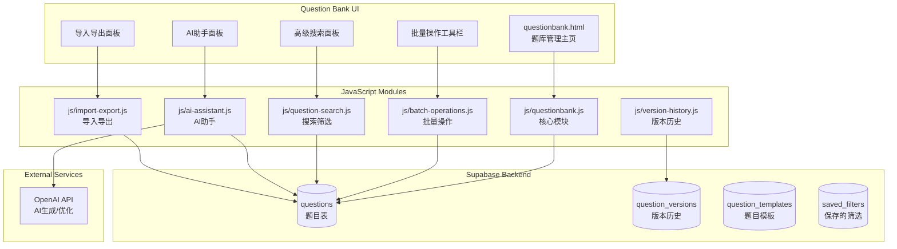

# Design Document: Question Bank Enhancement

## Overview

本设计文档描述智慧课堂系统题库管理增强功能的技术实现方案。主要包括批量操作、高级搜索、AI智能生成、导入导出增强、题目模板、版本历史等功能模块。

系统基于现有的 Supabase 后端和题库管理页面，采用模块化设计，保持与现有系统的兼容性。AI功能将集成主流大语言模型API（如OpenAI、Claude等）。

## Architecture



## Components and Interfaces

### 1. 批量操作模块 (js/batch-operations.js)

**功能**: 支持多选题目并进行批量增删改操作

**接口**:
```javascript
const BatchOperations = {
    // 选择管理
    selectedIds: Set,           // 当前选中的题目ID集合
    
    // 选择操作
    selectAll(questionIds),     // 全选当前页
    deselectAll(),              // 取消全选
    toggleSelect(questionId),   // 切换单个选择
    getSelectedCount(),         // 获取选中数量
    
    // 批量操作
    async batchDelete(supabase, questionIds),
    // 返回: { success: boolean, deleted: number, failed: number, errors: [] }
    
    async batchMove(supabase, questionIds, targetTaskId),
    // 返回: { success: boolean, moved: number, failed: number }
    
    async batchUpdate(supabase, questionIds, updates),
    // updates: { difficulty?, knowledge_tag?, task_id? }
    // 返回: { success: boolean, updated: number, failed: number }
    
    async batchCopy(supabase, questionIds, targetTaskId),
    // 返回: { success: boolean, copied: number, newIds: [] }
};
```

### 2. 高级搜索模块 (js/question-search.js)

**功能**: 多条件组合搜索和筛选题目

**接口**:
```javascript
const QuestionSearch = {
    // 搜索函数
    search(questions, keyword),
    // 在标题、选项、解析中搜索，返回匹配的题目数组
    
    // 筛选函数
    filter(questions, filters),
    // filters: { type?, difficulty?, knowledge_tag?, dateRange?, task_id? }
    // 返回筛选后的题目数组
    
    // 组合搜索+筛选
    searchAndFilter(questions, keyword, filters),
    // 返回同时满足搜索和筛选条件的题目
    
    // 高亮关键词
    highlightKeyword(text, keyword),
    // 返回带高亮标记的文本
    
    // 保存/加载筛选条件
    async saveFilter(supabase, name, filters),
    async loadSavedFilters(supabase),
    async deleteSavedFilter(supabase, filterId),
};
```

### 3. AI助手模块 (js/ai-assistant.js)

**功能**: 利用AI生成和优化题目

**接口**:
```javascript
const AIAssistant = {
    // 配置
    apiKey: string,
    apiEndpoint: string,
    model: string,
    
    // 生成题目
    async generateQuestions(options),
    // options: { topic, type, difficulty, count, context? }
    // 返回: { success: boolean, questions: [], error? }
    
    // 优化题目
    async optimizeQuestion(question),
    // 返回: { success: boolean, original, optimized, suggestions: [] }
    
    // 生成解析
    async generateExplanation(question),
    // 返回: { success: boolean, explanation: string }
    
    // 检查题目质量
    async checkQuality(question),
    // 返回: { score: number, issues: [], suggestions: [] }
    
    // 构建提示词
    buildGeneratePrompt(options),
    buildOptimizePrompt(question),
};
```

### 4. 导入导出模块 (js/import-export.js)

**功能**: 支持多格式的题目导入导出

**接口**:
```javascript
const ImportExport = {
    // 导入
    parseCSV(csvText, questionType),
    // 返回: { valid: [], invalid: [], errors: [] }
    
    parseExcel(file, questionType),
    // 返回: Promise<{ valid: [], invalid: [], errors: [] }>
    
    async importQuestions(supabase, questions, options),
    // options: { taskId, overwrite: boolean, startRound: number }
    // 返回: { success: number, skipped: number, errors: [] }
    
    // 导出
    exportToCSV(questions),
    // 返回: CSV字符串
    
    exportToExcel(questions),
    // 返回: Blob
    
    exportToJSON(questions),
    // 返回: JSON字符串
    
    // 验证
    validateQuestion(question, type),
    // 返回: { valid: boolean, errors: [] }
};
```

### 5. 版本历史模块 (js/version-history.js)

**功能**: 题目修改历史记录和版本恢复

**接口**:
```javascript
const VersionHistory = {
    // 保存版本
    async saveVersion(supabase, questionId, questionData),
    // 返回: { success: boolean, versionId }
    
    // 获取历史版本列表
    async getVersions(supabase, questionId),
    // 返回: [{ version_id, created_at, changes_summary }]
    
    // 获取特定版本内容
    async getVersion(supabase, versionId),
    // 返回: 完整的题目数据
    
    // 恢复到指定版本
    async restoreVersion(supabase, questionId, versionId),
    // 返回: { success: boolean }
    
    // 清理旧版本（保留最近N个）
    async cleanupVersions(supabase, questionId, keepCount = 10),
    // 返回: { deleted: number }
    
    // 比较两个版本
    compareVersions(version1, version2),
    // 返回: { changes: [{ field, old, new }] }
};
```

### 6. 题目模板模块 (js/question-templates.js)

**功能**: 预设和自定义题目模板

**接口**:
```javascript
const QuestionTemplates = {
    // 内置模板
    builtInTemplates: {
        single: { /* 单选题模板 */ },
        multiple: { /* 多选题模板 */ },
        truefalse: { /* 判断题模板 */ },
        fillblank: { /* 填空题模板 */ },
    },
    
    // 应用模板
    applyTemplate(templateId),
    // 返回: 预填充的题目对象
    
    // 自定义模板管理
    async saveTemplate(supabase, name, template),
    async getTemplates(supabase),
    async deleteTemplate(supabase, templateId),
    async updateTemplate(supabase, templateId, template),
};
```

## Data Models

### 新增表结构

**question_versions** - 题目版本历史表
```sql
CREATE TABLE question_versions (
    id UUID PRIMARY KEY DEFAULT gen_random_uuid(),
    question_id UUID NOT NULL REFERENCES questions(id) ON DELETE CASCADE,
    version_number INTEGER NOT NULL,
    content JSONB NOT NULL,           -- 完整的题目数据快照
    changes_summary TEXT,             -- 变更摘要
    created_at TIMESTAMP WITH TIME ZONE DEFAULT NOW(),
    created_by TEXT,                  -- 操作者
    UNIQUE(question_id, version_number)
);

CREATE INDEX idx_question_versions_question ON question_versions(question_id);
CREATE INDEX idx_question_versions_created ON question_versions(created_at DESC);
```

**question_templates** - 题目模板表
```sql
CREATE TABLE question_templates (
    id UUID PRIMARY KEY DEFAULT gen_random_uuid(),
    name VARCHAR(100) NOT NULL,
    description TEXT,
    question_type VARCHAR(20) NOT NULL,
    template_data JSONB NOT NULL,     -- 模板内容
    is_builtin BOOLEAN DEFAULT false,
    created_at TIMESTAMP WITH TIME ZONE DEFAULT NOW(),
    updated_at TIMESTAMP WITH TIME ZONE DEFAULT NOW()
);
```

**saved_filters** - 保存的筛选条件表
```sql
CREATE TABLE saved_filters (
    id UUID PRIMARY KEY DEFAULT gen_random_uuid(),
    name VARCHAR(100) NOT NULL,
    filter_data JSONB NOT NULL,       -- 筛选条件
    created_at TIMESTAMP WITH TIME ZONE DEFAULT NOW()
);
```

**ai_generation_log** - AI生成日志表
```sql
CREATE TABLE ai_generation_log (
    id UUID PRIMARY KEY DEFAULT gen_random_uuid(),
    action VARCHAR(20) NOT NULL,      -- generate, optimize, explain
    input_data JSONB,                 -- 输入参数
    output_data JSONB,                -- 输出结果
    tokens_used INTEGER,
    created_at TIMESTAMP WITH TIME ZONE DEFAULT NOW()
);
```

## Correctness Properties

*A property is a characteristic or behavior that should hold true across all valid executions of a system-essentially, a formal statement about what the system should do. Properties serve as the bridge between human-readable specifications and machine-verifiable correctness guarantees.*

### Property 1: Select All Completeness
*For any* list of questions displayed on a page, calling selectAll() SHALL result in all question IDs being added to the selectedIds set, and getSelectedCount() SHALL equal the total number of questions.
**Validates: Requirements 1.2, 1.6**

### Property 2: Batch Delete Correctness
*For any* set of selected question IDs, after batchDelete() completes successfully, none of the deleted IDs SHALL exist in the questions table, and the returned deleted count SHALL equal the number of IDs that were successfully removed.
**Validates: Requirements 1.3, 1.5**

### Property 3: Batch Move Correctness
*For any* set of question IDs and a valid target task ID, after batchMove() completes, all successfully moved questions SHALL have their task_id field set to the target task ID.
**Validates: Requirements 1.4, 2.4**

### Property 4: Batch Update Partial Fields
*For any* set of questions and a partial update object, batchUpdate() SHALL only modify the fields specified in the update object while preserving all other fields unchanged.
**Validates: Requirements 2.2, 2.3, 2.5**

### Property 5: Search Result Relevance
*For any* keyword and set of questions, the search() function SHALL return only questions where the keyword appears in at least one of: title, option_a, option_b, option_c, option_d, or explanation.
**Validates: Requirements 3.1**

### Property 6: Filter AND Logic
*For any* set of filter conditions, the filter() function SHALL return only questions that satisfy ALL specified conditions simultaneously.
**Validates: Requirements 3.2, 3.3**

### Property 7: Saved Filter Round Trip
*For any* filter configuration, saving and then loading the filter SHALL return an equivalent filter configuration.
**Validates: Requirements 3.5**

### Property 8: AI Generation Count Constraint
*For any* AI generation request with count parameter, the count SHALL be within the range [1, 10], and the number of generated questions SHALL not exceed the requested count.
**Validates: Requirements 4.4**

### Property 9: Import Validation Accuracy
*For any* import data containing both valid and invalid rows, the parser SHALL correctly identify all invalid rows with specific error messages, and the valid count plus invalid count SHALL equal the total row count.
**Validates: Requirements 6.3, 6.4, 6.5**

### Property 10: Export Completeness
*For any* set of questions exported to any format (CSV, Excel, JSON), the exported data SHALL contain all fields from the original questions, and re-importing the exported data SHALL produce equivalent questions.
**Validates: Requirements 7.2, 7.5**

### Property 11: Template Application
*For any* template, applying the template SHALL produce a question object with all template default values correctly populated.
**Validates: Requirements 8.2**

### Property 12: Version Creation on Edit
*For any* question edit operation, a version record SHALL be created containing the complete previous state of the question before the edit.
**Validates: Requirements 9.1**

### Property 13: Version Restore Correctness
*For any* question and any of its historical versions, restoring to that version SHALL result in the question's current state matching the version's content exactly.
**Validates: Requirements 9.4**

### Property 14: Version Limit Enforcement
*For any* question, the number of stored versions SHALL not exceed the configured limit (default 10), with oldest versions being removed first.
**Validates: Requirements 9.5**

### Property 15: Copy Preserves Content
*For any* question being copied, the new question SHALL have all field values identical to the original except for the ID field, which SHALL be a new unique identifier.
**Validates: Requirements 10.1, 10.2**

## Error Handling

### 网络错误处理
- 所有 Supabase 和 AI API 请求使用 try-catch 包装
- 网络失败时显示友好的错误提示
- 批量操作支持部分成功，返回详细的成功/失败统计

### 数据验证
- 导入数据进行严格的格式和内容验证
- AI生成的题目进行结构验证后才能保存
- 批量操作前验证所有目标ID的有效性

### AI服务错误
- API调用超时设置合理的超时时间（30秒）
- 速率限制时提示用户稍后重试
- API密钥无效时引导用户检查配置

### 边界情况
- 空选择时禁用批量操作按钮
- 大批量操作（>100条）显示进度提示
- 版本历史为空时显示友好提示

## Testing Strategy

### 单元测试
使用 Vitest 进行单元测试，覆盖核心功能：
- `BatchOperations` - 选择管理和批量操作
- `QuestionSearch` - 搜索和筛选逻辑
- `ImportExport` - 解析和导出功能
- `VersionHistory` - 版本管理
- `QuestionTemplates` - 模板应用

### 属性测试 (Property-Based Testing)
使用 fast-check 库进行属性测试，验证上述 Correctness Properties：
- 每个属性测试运行至少 100 次迭代
- 使用生成器创建随机测试数据
- 测试注释格式: `**Feature: questionbank-enhancement, Property {number}: {property_text}**`

### 测试文件结构
```
tests/
  questionbank/
    batch-operations.test.ts   # 批量操作测试
    question-search.test.ts    # 搜索筛选测试
    import-export.test.ts      # 导入导出测试
    version-history.test.ts    # 版本历史测试
    templates.test.ts          # 模板功能测试
```

### AI功能测试
- AI相关功能使用mock进行单元测试
- 集成测试需要有效的API密钥
- 测试覆盖正常响应和错误处理场景

