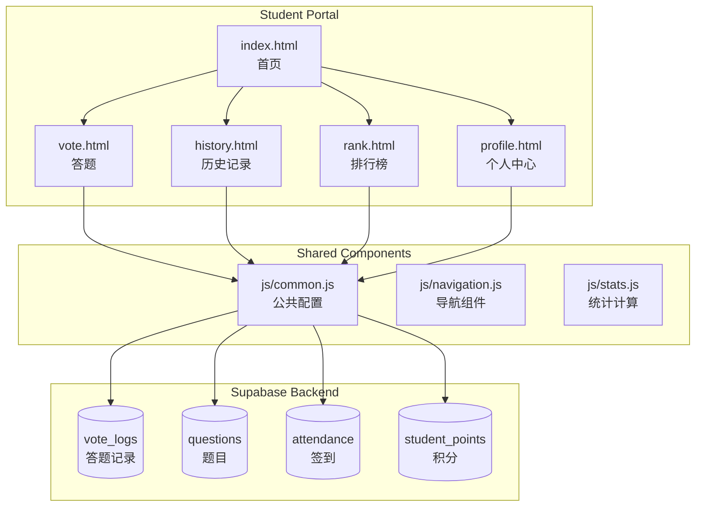

# Design Document: Student Experience Enhancement

## Overview

本设计文档描述智慧课堂系统学生端体验优化功能的技术实现方案。主要包括学生个人中心、答题历史记录、积分排行榜、答题即时反馈和导航优化等功能模块。

系统基于现有的 Supabase 后端，采用纯前端 HTML/JavaScript 实现，保持与现有学生端页面一致的技术栈和设计风格。

## Architecture



## Components and Interfaces

### 1. 学生个人中心 (profile.html)

**功能**: 展示学生个人信息和学习统计数据

**接口**:
```javascript
// 获取学生统计数据
async function getStudentStats(studentId) {
    // 返回: { todayCount, todayCorrect, todayPoints, totalCount, totalCorrect, totalPoints, rank }
}

// 获取学生排名
async function getStudentRank(studentId) {
    // 返回: { rank, totalStudents }
}
```

### 2. 答题历史记录 (history.html)

**功能**: 展示和筛选学生的答题历史

**接口**:
```javascript
// 获取答题历史
async function getAnswerHistory(studentId, options = {}) {
    // options: { startDate, endDate, wrongOnly, page, pageSize }
    // 返回: { records: [], total, page, pageSize }
}

// 筛选答题记录
function filterRecords(records, { startDate, endDate, wrongOnly }) {
    // 返回筛选后的记录数组
}

// 排序答题记录（按时间倒序）
function sortRecordsByTime(records) {
    // 返回排序后的记录数组
}
```

### 3. 积分排行榜 (rank.html)

**功能**: 展示班级积分排名

**接口**:
```javascript
// 获取排行榜数据
async function getLeaderboard(options = {}) {
    // options: { type: 'today' | 'total', limit: 20 }
    // 返回: [{ rank, studentId, studentName, points }]
}

// 计算学生排名
function calculateRank(students, studentId) {
    // 返回: { rank, isInTop20 }
}
```

### 4. 答题反馈增强 (vote.html 修改)

**功能**: 答题结束后显示正确答案和解析

**接口**:
```javascript
// 显示答题反馈
function showAnswerFeedback(question, studentAnswer, classStats) {
    // question: 题目对象
    // studentAnswer: 学生答案
    // classStats: { total, correct, accuracy }
}

// 计算班级正确率
async function getClassAccuracy(round) {
    // 返回: { total, correct, accuracy }
}
```

### 5. 导航组件增强 (js/navigation.js 修改)

**功能**: 更新底部导航栏，添加新页面入口

**接口**:
```javascript
// 导航项配置
const NAV_ITEMS = [
    { id: 'home', href: 'index.html', icon: '🏠', label: '首页' },
    { id: 'vote', href: 'vote.html', icon: '📊', label: '答题' },
    { id: 'history', href: 'history.html', icon: '📚', label: '历史' },
    { id: 'rank', href: 'rank.html', icon: '🏆', label: '排行' },
    { id: 'profile', href: 'profile.html', icon: '👤', label: '我的' }
];
```

### 6. 统计计算模块 (js/stats.js 新增)

**功能**: 提供统一的统计计算函数

**接口**:
```javascript
// 计算正确率
function calculateAccuracy(correct, total) {
    // 返回: 百分比数值 (0-100)
}

// 计算积分
function calculatePoints(isCorrect, basePoints = 10) {
    // 返回: 积分数值
}

// 计算今日统计
function calculateTodayStats(records) {
    // 返回: { count, correct, accuracy, points }
}

// 计算总统计
function calculateTotalStats(records) {
    // 返回: { count, correct, accuracy, points }
}
```

## Data Models

### 现有表结构 (无需修改)

**vote_logs** - 答题记录表
```sql
- id: uuid (PK)
- student_id: text
- student_name: text
- round: integer
- option: text (学生答案)
- is_correct: boolean
- created_at: timestamp
```

**questions** - 题目表
```sql
- id: uuid (PK)
- round: integer
- title: text
- option_a, option_b, option_c, option_d: text
- answer: text
- explanation: text (题目解析，新增字段)
- type: text (single/multi/judge)
- task_id: uuid (FK)
```

### 新增/修改表结构

**student_points** - 学生积分表 (新增)
```sql
CREATE TABLE student_points (
    id uuid PRIMARY KEY DEFAULT gen_random_uuid(),
    student_id text NOT NULL,
    student_name text NOT NULL,
    points integer DEFAULT 0,
    today_points integer DEFAULT 0,
    last_updated date,
    created_at timestamp DEFAULT now(),
    UNIQUE(student_id)
);
```

**questions 表修改** - 添加解析字段
```sql
ALTER TABLE questions ADD COLUMN IF NOT EXISTS explanation text;
```

## Correctness Properties

*A property is a characteristic or behavior that should hold true across all valid executions of a system-essentially, a formal statement about what the system should do. Properties serve as the bridge between human-readable specifications and machine-verifiable correctness guarantees.*

### Property 1: Statistics Calculation Accuracy
*For any* set of answer records for a student, the calculated statistics (count, correct count, accuracy percentage) SHALL be mathematically correct.
- count = total number of records
- correct = number of records where is_correct === true
- accuracy = (correct / count) * 100, or 0 if count is 0
**Validates: Requirements 1.2, 1.3**

### Property 2: Answer History Sorting
*For any* list of answer records, sorting by time descending SHALL result in records ordered from newest to oldest (created_at[i] >= created_at[i+1] for all i).
**Validates: Requirements 2.1**

### Property 3: Date Range Filter Correctness
*For any* list of answer records and a date range [startDate, endDate], the filtered result SHALL contain only records where startDate <= created_at <= endDate.
**Validates: Requirements 2.3**

### Property 4: Wrong Answer Filter Correctness
*For any* list of answer records, filtering for wrong answers only SHALL return exactly the records where is_correct === false.
**Validates: Requirements 2.4**

### Property 5: Leaderboard Ordering
*For any* set of students with points, the leaderboard SHALL be sorted in descending order by points (points[i] >= points[i+1] for all i).
**Validates: Requirements 3.1**

### Property 6: Leaderboard Limit
*For any* leaderboard query with limit N, the result SHALL contain at most N entries.
**Validates: Requirements 3.1**

### Property 7: Student Rank Calculation
*For any* student in a set of students with points, their rank SHALL equal 1 plus the count of students with strictly higher points.
**Validates: Requirements 1.4, 3.2, 3.3**

### Property 8: Points Calculation
*For any* answer submission, points awarded SHALL be basePoints (default 10) if is_correct is true, and 0 if is_correct is false.
**Validates: Requirements 6.1, 6.2, 6.3**

### Property 9: Answer Feedback Display
*For any* question with a correct answer, when feedback is shown, the correct answer option SHALL have the 'correct' CSS class applied.
**Validates: Requirements 4.1, 4.2**

### Property 10: Class Accuracy Calculation
*For any* set of answer records for a round, the class accuracy SHALL equal (correct answers / total answers) * 100.
**Validates: Requirements 4.5**

### Property 11: Navigation Item Highlighting
*For any* current page path, exactly one navigation item SHALL have the 'active' class, and it SHALL correspond to the current page.
**Validates: Requirements 5.4**

## Error Handling

### 网络错误处理
- 所有 Supabase 请求使用 try-catch 包装
- 网络失败时显示友好的错误提示
- 提供重试按钮

### 数据验证
- 学生ID和姓名从 localStorage 获取，未签到时跳转到签到页
- 空数据状态显示友好提示
- 分页参数验证（page >= 1, pageSize > 0）

### 边界情况
- 无答题记录时显示空状态
- 积分为0时正常显示
- 排名超出前20名时单独显示

## Testing Strategy

### 单元测试
使用 Vitest 进行单元测试，覆盖核心计算函数：
- `calculateAccuracy()` - 正确率计算
- `calculatePoints()` - 积分计算
- `sortRecordsByTime()` - 时间排序
- `filterRecords()` - 记录筛选
- `calculateRank()` - 排名计算

### 属性测试 (Property-Based Testing)
使用 fast-check 库进行属性测试，验证上述 Correctness Properties：
- 每个属性测试运行至少 100 次迭代
- 使用生成器创建随机测试数据
- 测试注释格式: `**Feature: student-experience, Property {number}: {property_text}**`

### 测试文件结构
```
tests/
  student-experience/
    stats.test.ts        # 统计计算测试
    history.test.ts      # 历史记录测试
    leaderboard.test.ts  # 排行榜测试
    feedback.test.ts     # 答题反馈测试
    navigation.test.ts   # 导航组件测试
```
